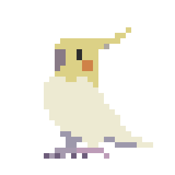

<table>
    <thead>
        <tr>
            <th>
                <h1>Olá! I'm Isabela, a student from Brazil. 🇧🇷</h1>
                

                    
                    
                

            </th>
            <th>
                
            </th>
        </tr>
        <tr>
            <th colspan=2>
                

                
                
                
                
                
                
                
                
                
                
                
                
                

            </th>
        </tr>
    </thead>
    <tbody>
            <tr>
                <td colspan=2>
                 
                
I'm a Data Science graduate looking to get into web development or software engineering field.  
                I'm passionate about many things, such as birds, retro videogames, digital art and FOSS software.

                
I love learning new things and helping people however I can whenever possible 💙  

                

                 
            </td>
            </tr>
    </tbody>
</table>

  

--------------

*Still trying to figure things out and looking forward to contributing to the open source community one day!*

